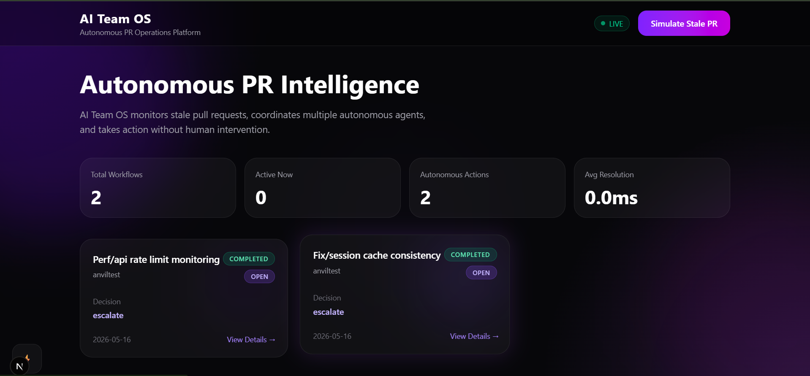
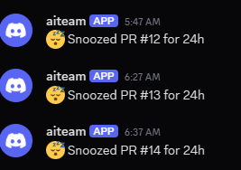
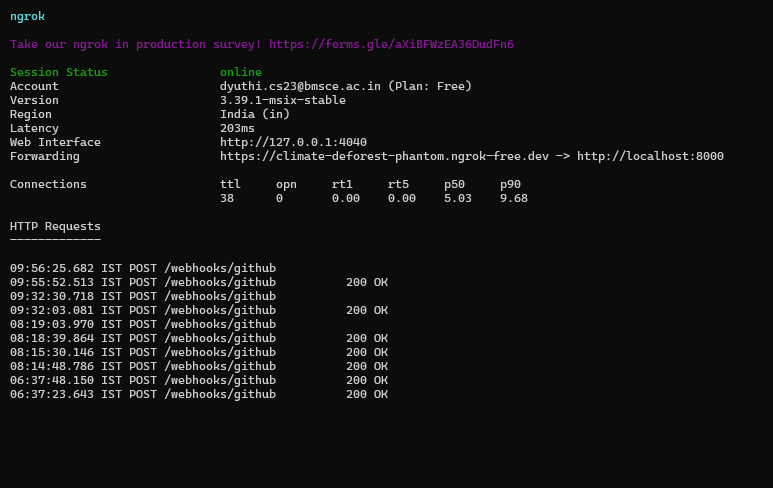
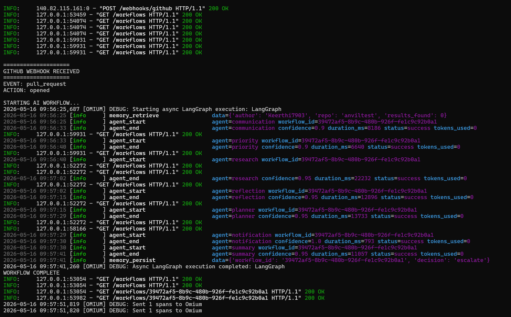
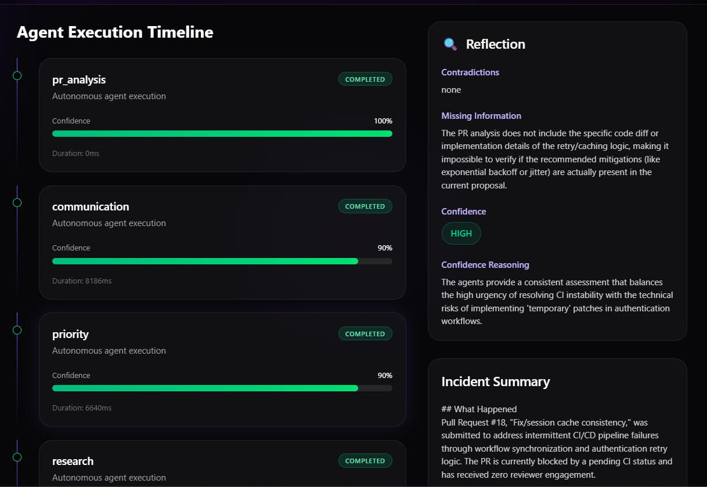
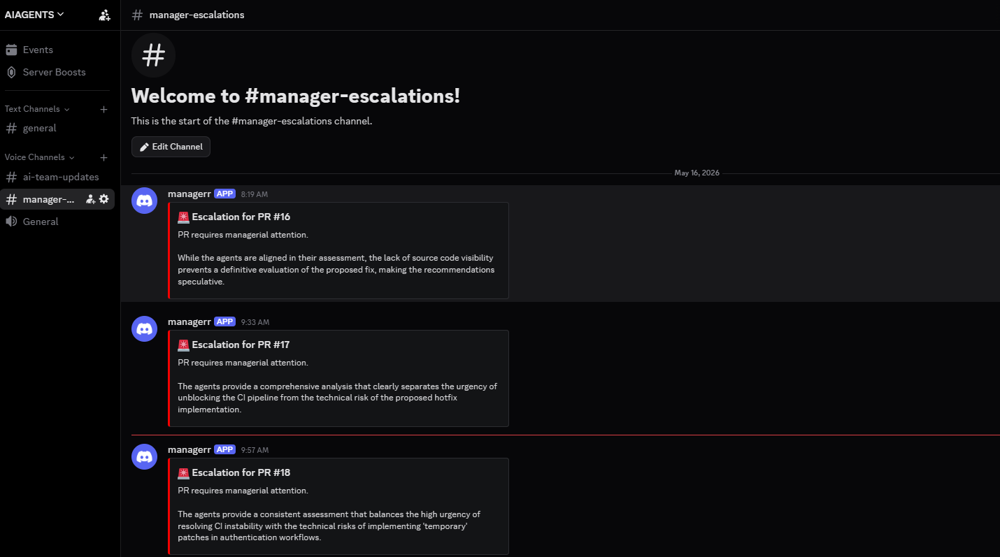
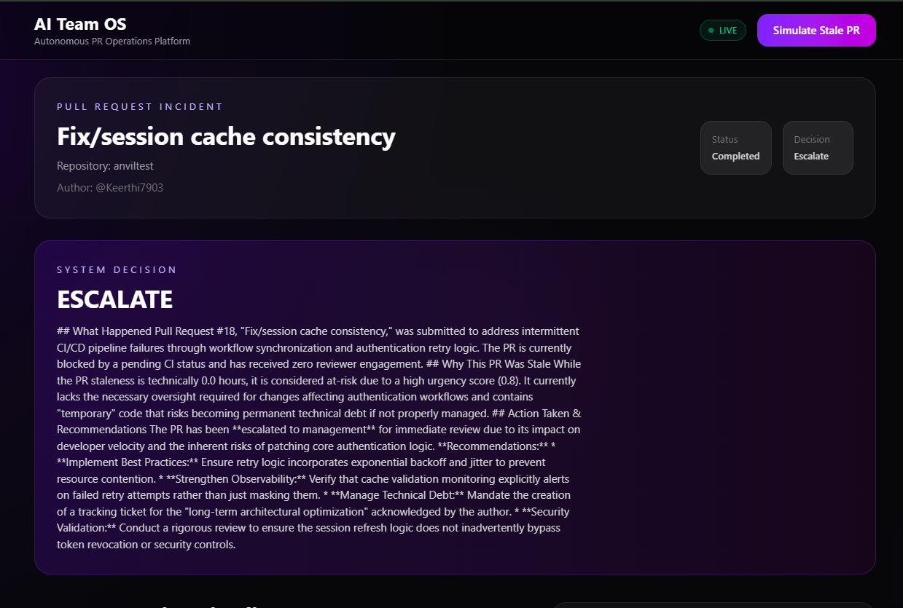
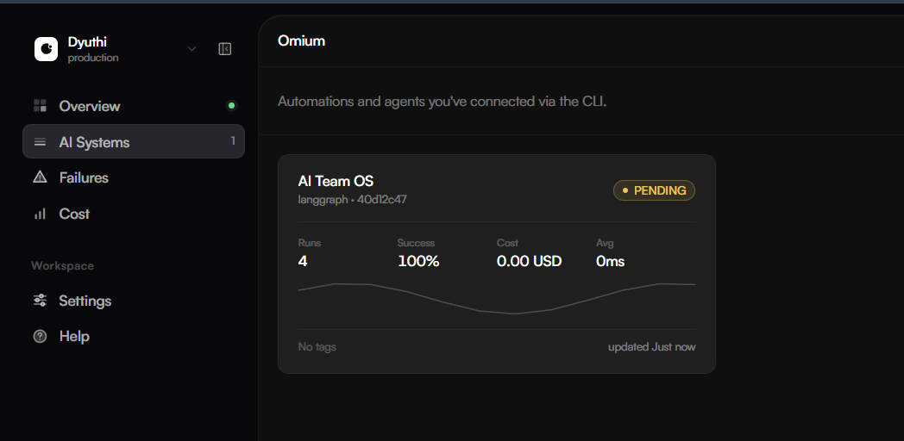
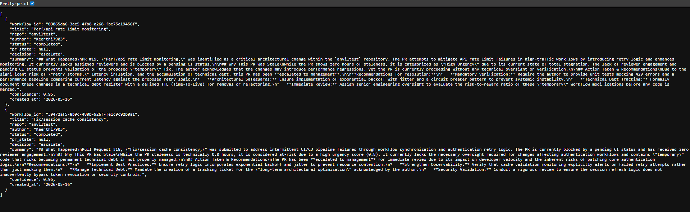

# 🚀 AI Team OS  
### Autonomous PR Operations Platform using Multi-Agent AI + LangGraph + Omium

<p align="center">
  
</p>

---

# 📌 Problem Statement

Modern engineering teams struggle with:

- Stale Pull Requests
- Delayed Reviews
- CI/CD Failures
- Communication Gaps
- Lack of Escalation Mechanisms
- Manual PR Monitoring
- Engineering Bottlenecks

Our solution introduces a **fully autonomous AI-powered PR Operations Platform** capable of:

✅ Monitoring GitHub Pull Requests  
✅ Coordinating Multiple AI Agents  
✅ Performing Autonomous Decision Making  
✅ Escalating High-Risk PRs  
✅ Sending Discord Notifications  
✅ Tracking Agent Health using Omium SDK  
✅ Providing Real-Time Incident Intelligence  

---

# 🧠 What is AI Team OS?

AI Team OS is a **Multi-Agent Autonomous Incident Management System** for GitHub Pull Requests.

The platform continuously monitors PR events, analyses engineering risks using specialized AI agents, and takes autonomous actions such as:

- Escalation
- Snoozing
- Notifications
- Incident Reporting
- Risk Reflection
- Research-Based Validation

without requiring human intervention.

---

# ✨ Core Features

## ✅ Autonomous Multi-Agent Workflow

Each PR is processed by multiple specialized AI agents.

| Agent | Responsibility |
|---|---|
| `pr_analysis` | Extracts PR metadata and risk signals |
| `communication` | Analyses reviewer engagement and sentiment |
| `priority` | Determines urgency level |
| `research` | Performs external technical reasoning |
| `reflection` | Detects contradictions and missing information |
| `planner` | Makes final autonomous decision |
| `notification` | Sends Discord alerts |
| `summary` | Generates final incident report |

---

## ✅ GitHub Webhook Automation

- Real-time GitHub PR event monitoring
- Automatic workflow triggering
- Autonomous incident execution pipeline

---

## ✅ Discord Escalation System

Critical PRs are escalated directly to managers through Discord.

<p align="center">
  
</p>

---

## ✅ Omium SDK Integration

We integrated the **Omium SDK** for:

- Agent observability
- Workflow tracing
- Live execution monitoring
- Health tracking
- Execution analytics
- Multi-agent visibility

---

# 🏗️ System Architecture

```text
GitHub PR Event
       ↓
GitHub Webhook
       ↓
FastAPI Backend
       ↓
LangGraph Workflow
       ↓
Multi-Agent Execution Pipeline
       ↓
Reflection + Planning
       ↓
Autonomous Decision
       ↓
Discord Escalation + Incident Summary
       ↓
Frontend Dashboard + Omium Monitoring
```

---

# ⚙️ Tech Stack

| Technology | Purpose |
|---|---|
| Python | Backend Logic |
| FastAPI | API + Webhooks |
| LangGraph | Multi-Agent Workflow Orchestration |
| Gemini API | AI Reasoning |
| Omium SDK | Agent Monitoring + Observability |
| Next.js | Frontend Dashboard |
| TailwindCSS | UI Styling |
| SQLite | Workflow Persistence |
| SQLAlchemy | ORM |
| Discord Webhooks | Escalation Alerts |
| GitHub Webhooks | PR Event Triggers |
| Ngrok | Public Tunnel for Localhost |

---

# 🧩 Workflow Execution Pipeline

## 1️⃣ Pull Request Created

Developer creates a PR on GitHub.

---

## 2️⃣ GitHub Webhook Triggered

GitHub sends webhook event to FastAPI backend.

<p align="center">
  
</p>

Demo repository URL for initializing the pull request to match real-world use case:
https://github.com/Keerthi7903/anviltest

---

## 3️⃣ LangGraph Workflow Starts

The autonomous workflow initializes.

<p align="center">
  
</p>

---

## 4️⃣ AI Agents Execute Sequentially

Each AI agent contributes independent reasoning.

### Example Agent Execution:

- Communication Analysis
- Priority Assessment
- Technical Research
- Reflection Layer
- Autonomous Planning

---

## 5️⃣ Reflection Layer

The reflection agent identifies:

- Missing information
- Contradictions
- Confidence levels

<p align="center">
  
</p>

---

## 6️⃣ Autonomous Decision

The planner agent decides whether to:

- Escalate
- Snooze
- Proceed

---

## 7️⃣ Discord Notification

Managers receive escalation alerts instantly.

<p align="center">
  
</p>

---

## 8️⃣ Frontend Dashboard Updates

All incidents are displayed live.

<p align="center">
  
</p>

---

# 🖥️ Frontend Dashboard

The dashboard provides:

- Incident Tracking
- PR Status Monitoring
- Autonomous Decisions
- Agent Timelines
- Reflection Summaries
- Workflow Analytics

---

## Incident Overview

<p align="center">
  
</p>

---

## Agent Timeline & Reflection

<p align="center">
  
</p>

---

# 🔍 Omium Dashboard Monitoring

Omium tracks:

- Agent health
- Workflow traces
- Execution runtime
- Live workflow status
- Checkpoints
- Multi-agent observability

<p align="center">
  
</p>

---

# 📡 API Output

The backend exposes workflow execution data through REST APIs.

<p align="center">
  
</p>

---

# 📂 Project Structure

```bash
AI-TEAM-OS/
│
├── agents/
│   ├── communication.py
│   ├── planner.py
│   ├── priority.py
│   ├── reflection.py
│   ├── research.py
│   ├── summary.py
│   └── pr_analysis.py
│
├── backend/
│   ├── api/
│   ├── database/
│   └── models/
│
├── frontend/
│
├── workflows/
│   └── langgraph_workflow.py
│
├── tools/
├── utils/
├── schemas/
├── config.py
└── README.md
```

---

# 🚀 How To Run The Project

---

## 1️⃣ Clone Repository

```bash
git clone https://github.com/Keerthi7903/ANVIL_DKC.git
cd ANVIL_DKC
```

---

## 2️⃣ Create Virtual Environment

```bash
python -m venv venv
```

Activate:

### Windows

```bash
venv\Scripts\activate
```

### Linux/Mac

```bash
source venv/bin/activate
```

---

## 3️⃣ Install Backend Dependencies

```bash
pip install -r requirements.txt
```

---

## 4️⃣ Install Frontend Dependencies

```bash
cd frontend
npm install
```

---

## 5️⃣ Configure Environment Variables

Create `.env`

```env
GEMINI_API_KEY=YOUR_KEY
GITHUB_TOKEN=YOUR_TOKEN
DISCORD_WEBHOOK_URL=YOUR_WEBHOOK
DISCORD_MANAGER_WEBHOOK_URL=YOUR_WEBHOOK
OMIUM_API_KEY=YOUR_OMIUM_KEY
USE_MOCK_AI=False
```

---

## 6️⃣ Start Backend

```bash
uvicorn backend.api.main:app --reload
```

---

## 7️⃣ Start Frontend

```bash
cd frontend
npm run dev
```

---

## 8️⃣ Start Ngrok

```bash
ngrok http 8000
```

Copy generated HTTPS URL.

---

## 9️⃣ Configure GitHub Webhook

GitHub Repository → Settings → Webhooks

Payload URL:

```bash
https://your-ngrok-url/webhooks/github
```

Events:

✅ Pull Requests

---

# 🧠 Omium Integration

We integrated Omium SDK to monitor:

- AI agent execution
- Workflow traces
- Checkpoints
- Runtime analytics
- Autonomous system health

Initialization:

```python
import omium

omium.init(
    project="AI Team OS",
    api_key=settings.OMIUM_API_KEY,
    auto_trace=True
)
```

---

# 🎯 Real-World Impact

This system can help:

- DevOps Teams
- Engineering Managers
- Technical Leads
- Enterprise Development Teams
- CI/CD Monitoring Teams

by reducing:

❌ PR bottlenecks  
❌ Delayed reviews  
❌ Silent failures  
❌ Communication gaps  
❌ Manual escalation overhead  

---

# 🔮 Future Improvements

- Slack Integration
- Jira Ticket Automation
- Risk Prediction Models
- Auto Reviewer Assignment
- PR Auto-Fix Suggestions
- Team Performance Analytics
- Voice Incident Summaries

---

# 🏆 Why This Project Matters

AI Team OS demonstrates how Multi-Agent AI systems can:

- Collaborate autonomously
- Reason independently
- Reflect critically
- Make operational decisions
- Escalate engineering risks
- Improve software delivery pipelines

This is a practical example of **Autonomous AI Operations for Real Engineering Teams**.

---

# 👨‍💻 Team

Built for the ANVIL Hackathon 🚀

### Team Members

- Dyuthi
- Kamireddy Keerthi Reddy
- Chitrashree K

---

# 📜 License

MIT License

---

# ⭐ Final Note

AI Team OS is not just a dashboard.

It is a fully autonomous engineering operations layer powered by collaborative AI agents capable of monitoring, reasoning, reflecting, escalating, and assisting software teams in real-time.
